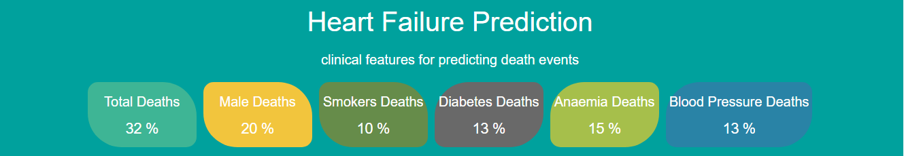
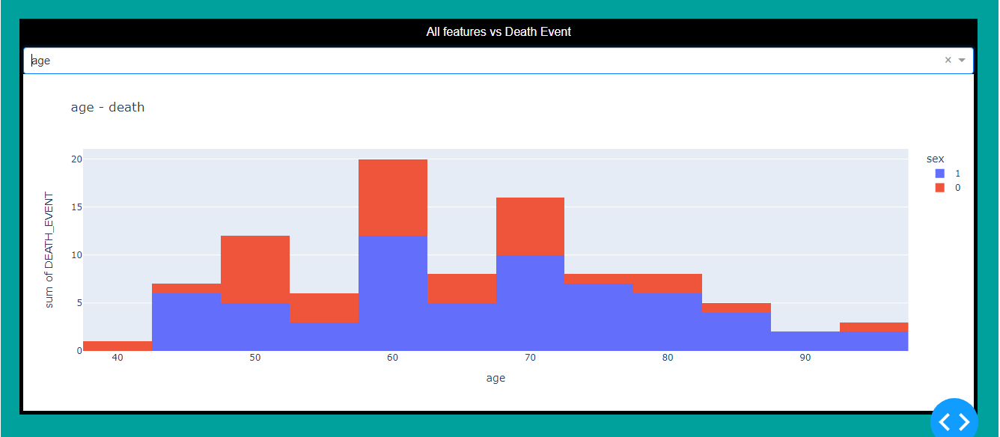
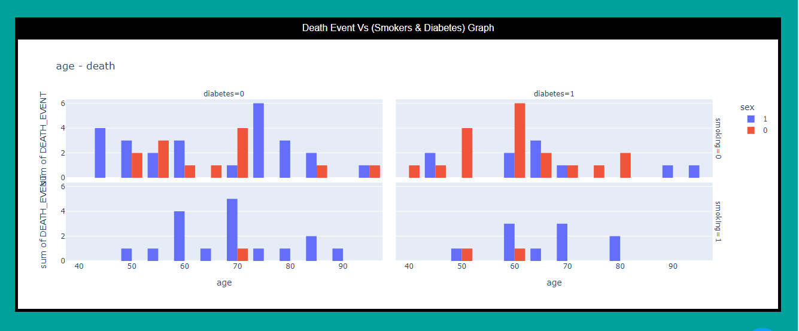
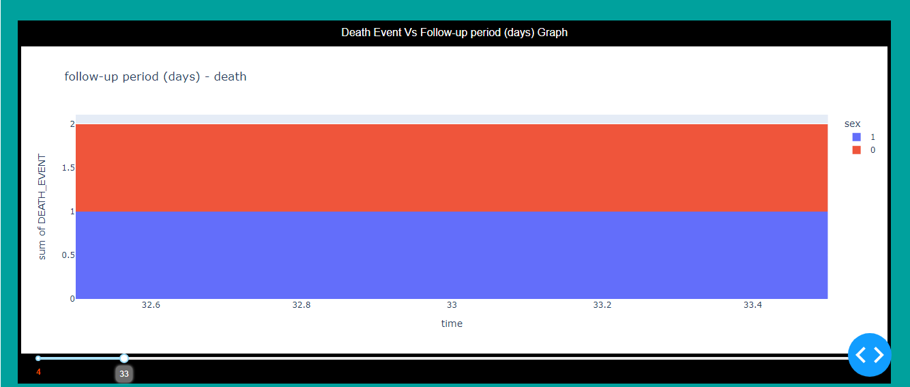

# Data-Visualization
## Heart Failure Predection Visualization
  

* Data Visualization Project for Heart Failure Prediction Using Dash

### Requirements : 
* Python
* Dash
* Plotly
* Pandas
* CSS
* HTML

### Images from the project : 

# Dataset :
* https://www.kaggle.com/andrewmvd/heart-failure-clinical-data

to run:http://127.0.0.1:8050/
